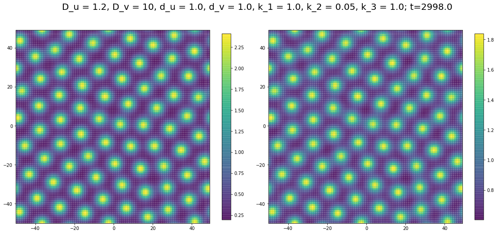

# 第１１回 パターン形成

## 反応拡散モデル  Reaction Diffusion Model （ギーラー-マインハルト系 Gierer–Meinhardt system）

$$
\begin{cases}
\frac{\partial u}{\partial t} = D_u \nabla^2 u - d_u u + k_1 \frac{u^2}{v} + k_2\\
\frac{\partial v}{\partial t} = D_v \nabla^2 v - d_v v \ + k_3 u^2 
\end{cases}
$$

